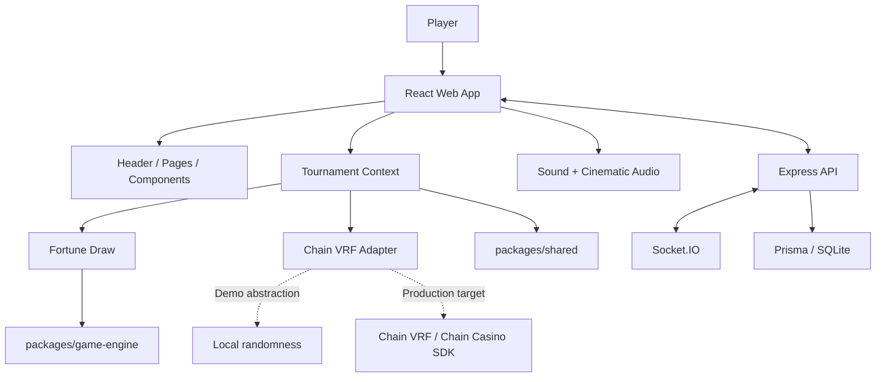

# House of Fortune Architecture

## System overview

House of Fortune is a React/TypeScript tournament application organized as a small monorepo. The frontend owns the interactive tournament experience, shared packages define the domain contract, the backend provides an Express/Socket.IO foundation, and Prisma defines the persistence model.



## Runtime responsibilities

### Frontend: `apps/web`

Responsible for:

- Home and tournament entry.
- Five-level tournament lobby.
- Fortune Draw interaction.
- Wallet and virtual-credit presentation.
- BANK/RISK decisions.
- Result overlays and final stats.
- Player/team identity.
- Audio and cinematic feedback.

Primary state container:

`apps/web/src/game/tournamentContext.tsx`

### Chain boundary: `apps/web/src/chain`

`ChainVRF` provides the randomness integration boundary. The current repository uses a local simulation for hackathon/demo execution.

Production boundary:

```text
Game request
   ↓
Chain VRF request
   ↓
Verified random fulfillment
   ↓
Outcome resolver
   ↓
Fortune board
```

The browser should not be treated as the final authority for production game outcomes.

### Shared domain: `packages/shared`

Contains the TypeScript domain model:

- `GameState`
- `GamePhase`
- `GameStatus`
- `GameStage`
- `FortuneTile`
- `FortuneSymbol`
- `Competitor`
- `Transaction`
- Result overlay data

This keeps frontend and backend contracts aligned.

### Backend: `apps/server`

Current responsibilities:

- Express HTTP server.
- Health endpoint.
- CORS.
- Socket.IO server.
- Tournament-room join/disconnect foundation.

Current endpoint:

```
GET /health
```

Current real-time event:

```
join_tournament
player_joined
```

### Database: `packages/database`

Prisma schema models:

- `User`
- `Wallet`
- `WalletTransaction`
- `Tournament`
- `TournamentPlayer`
- `GameSession`

The schema separates wallet balances, transaction records, tournament participation, and game sessions.

## State flow

```text
HOME
  ↓ startTournament
LOBBY
  ↓ enterCurrentLevel
FORTUNE_DRAW
  ↓ placeWager
WAITING_VRF
  ↓ outcome received
REVEALING
  ↓ revealTile
CASHOUT_DECISION
  ├── BANK → ROUND_WIN → LOBBY / FINAL_STATS
  └── RISK → REVEALING → improve or ROUND_LOSS
```

## Wallet invariant

The logical wallet model should maintain:

```
available credits + active wager + secured tournament reward
= controlled credits
```

A wager should move credits from available balance into the active wager once, then return or settle them exactly once when the round resolves.

## Security boundaries

For a production implementation:

1. Client UI should request actions, not authoritatively decide outcomes.
2. Randomness should come from a verifiable source.
3. Reward settlement should occur in a trusted backend or chain-controlled boundary.
4. Wallet transactions should be append-only records with idempotent settlement references.
5. Authentication and authorization should protect tournament sessions.
6. Client-controlled reward values should never be trusted.

## Deployment topology

```text
                 Internet
                    |
             CDN / Web Host
                    |
              apps/web build
                    |
          -----------------------
          |                     |
      API requests         Socket.IO
          |                     |
          +--------> Node server
                         |
                    Prisma layer
                         |
                     Database
```

## Current vs production

| Area | Current demo | Production target |
|---|---|---|
| Randomness | Local simulation | Chain VRF / authoritative SDK |
| Wallet | Client-side demo state | Trusted settlement service / chain |
| Multiplayer | Socket.IO foundation | Authoritative synchronized tournament state |
| Persistence | Prisma schema prepared | Live transactional persistence |
| RTP | Development assertion | Automated exhaustive/simulation validation |
| Security | Demo scope | Threat model + auth + abuse controls |

## Key design principle

**The UI is a client of the game system, not the authority of the game system.**

That distinction matters once virtual demo credits become real economic state.
